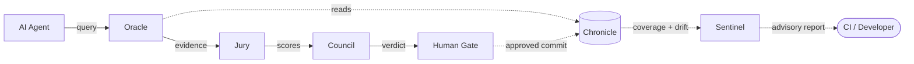
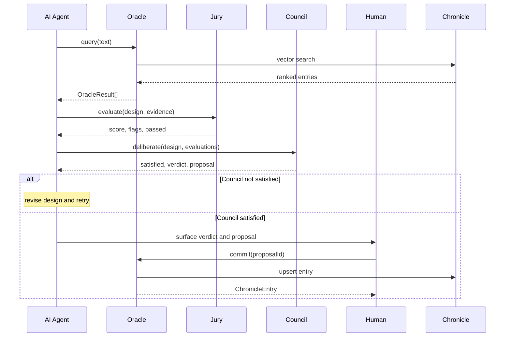
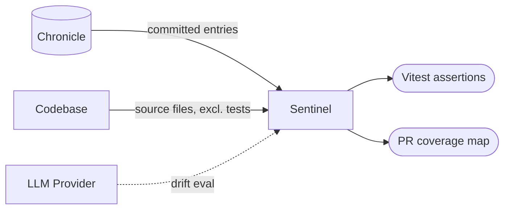

# Quorum

Quorum is a portable reasoning layer for agentic codebases.

Drop the `quorum/` folder into any Node.js project, tell your AI to follow `quorum/SETUP.md`, and it wires itself in — installing dependencies, merging instruction files, and initialising a persistent knowledge store called Chronicle.

From that point, every AI agent working in the codebase queries Chronicle before proposing solutions, and every significant decision gets written back to it (with human approval). Over time it becomes the institutional memory of the project: what was tried, what worked, what failed, and why.

---

## What's inside

Four portable TypeScript modules:

| Module | What it does |
|---|---|
| **Oracle** | Query and write interface to Chronicle. No LLM required. |
| **Jury** | Evaluates a proposed design against Oracle evidence. Returns a confidence score. |
| **Council** | Adversarial validation via a parallel panel of advisors and reviewers. Returns a verdict. |
| **Sentinel** | Chronicle coverage and drift detection. Surfaces gaps and stale knowledge as Vitest assertions. |

```
oracle.query()  →  jury.evaluate()  →  council.deliberate()  →  human gate  →  Executor
sentinel.coverage() + sentinel.detectDrift()  →  advisory test output
```

---

## How it works

**Flow — system components and connections:**



**Sequence — one full decision cycle:**



---

## How to use it

Run this from any Node.js project root:

```bash
npx @balpal4495/quorum@latest init
```

Quorum scaffolds itself — copying modules into `quorum/`, merging AI instruction files (CLAUDE.md, AGENTS.md), and initialising Chronicle. Then run `npm install`.

For manual control or AI-assisted setup, tell your AI: *"follow quorum/SETUP.md"*.

See [SETUP.md](SETUP.md) for the full bootstrap sequence.

---

## Chronicle

Chronicle lives at `.chronicle/` and is the persistent knowledge store that underpins everything. Every Oracle entry goes through a human-gated write path — `oracle.propose()` stages it, a human calls `oracle.commit()` to index it. There are no auto-commits.

```
.chronicle/
  committed/    ← approved entries as JSON (committed to git, source of truth)
  proposals/    ← staged entries awaiting human approval (JSON, not indexed yet)
  SUMMARY.md    ← auto-generated agent context, rebuilt on every commit
```

`SUMMARY.md` groups the last 12 weeks of entries by week and work context. It gives agents temporal sequence — what happened and in what order — which vector search alone cannot provide.

---

## Dependencies

| Package | Purpose |
|---|---|
| `zod` | Structured LLM output validation |
| `vectordb` | LanceDB embedded vector store (swappable) |
| `@xenova/transformers` | Local ONNX embedder — all-MiniLM-L6-v2 (swappable) |

The LLM provider is injectable — Quorum defines a simple function interface and never hardcodes a provider. Wire OpenAI, Anthropic, or anything else at the application level.

---

## Designed to be dropped in — not installed

Quorum is intentionally a folder, not an npm package. The source lives in your repo, the modules are readable by any AI agent working in the codebase, and the instruction files (`AGENTS.md`, `CLAUDE.md`) travel with the code. Nothing is hidden inside `node_modules`.

---

## Sentinel

Sentinel answers three questions Chronicle cannot answer about itself.

**Coverage** — which files have no Chronicle entries? These are the blind spots where agents have no prior knowledge to draw on.

**Drift** — do existing Chronicle entries still accurately describe the code? Insights become stale without anyone noticing.

**PR coverage map** — when a PR is opened, every module in the codebase is shown with its Chronicle coverage percentage, risk colour, and how many files the PR touches. Reviewers see exactly where the knowledge is solid and where it goes dark — as a table and a colour-coded heatmap, not a prose summary.

Sentinel is designed for both new and established projects. On a brand-new project with no Chronicle entries it surfaces a bootstrap prompt rather than a wall of red. As the project matures, coverage thresholds can be raised to enforce standards in CI.

### In CI — coverage and drift as Vitest assertions

```typescript
import { describe } from "vitest"
import { sentinelAssertions } from "./modules/sentinel/assert"

const assertions = sentinelAssertions({
  chronicleDir: ".chronicle",
  codebasePath: "src",          // path to your source tree — defaults to "."
  llm: myLLMProvider,           // optional — drift tests skip gracefully when absent
  minCoveragePercent: 50,       // optional — 0 (default) = advisory only, never fails CI
})

describe("sentinel", () => { assertions.forEach(a => a()) })
```

Coverage tests are deterministic — no LLM required, always run. By default (`minCoveragePercent: 0`) gaps are logged but CI never fails, which is right for a new project. Raise the threshold as Chronicle matures. Drift tests are always advisory — they skip when no LLM is configured and never hard-block the build.

Test files (`__tests__/`, `*.test.ts`, `*.spec.ts`) are excluded from tracking by default — only source files count toward coverage.

### In PRs — the coverage map

The `sentinel-pr.yml` workflow runs on every PR and posts a comment with a full-project coverage table and a colour-coded Mermaid heatmap. Changed modules are bolded. The comment updates in place on each push — one comment per PR, never a thread of duplicates.

```
## Sentinel — Chronicle Coverage Map — 2026-W20

| Module   | Coverage | Entries | Files | PR Changes  | Risk   |
|----------|----------|---------|-------|-------------|--------|
| council/ | 0%       | 0       | 8     | —           | high   |
| jury/    | 0%       | 0       | 4     | —           | high   |
| oracle/  | 22%      | 4       | 9     | —           | medium |
| scripts/ | 0%       | 0       | 1     | **1 files** | high   |
| sentinel/| 0%       | 0       | 5     | **2 files** | high   |
| shared/  | 100%     | 2       | 1     | —           | low    |

[mermaid heatmap — Chronicle root → all modules, nodes coloured red/yellow/green by risk,
 changed modules labelled with file count]

### Chronicle context for changed modules
**oracle/**
- `[30bdc1c1]` schema constraints not LLM self-evaluation — validated (0.88)
```

On a new project with no Chronicle entries, the comment instead shows a bootstrap prompt guiding the team toward their first `oracle.propose()` call.



---

## Module docs

- [modules/README.md](modules/README.md) — full API reference and quick-start
- [modules/AGENTS.md](modules/AGENTS.md) — file ownership and invariants
- [modules/CLAUDE.md](modules/CLAUDE.md) — design decisions and what not to change
- [SETUP.md](SETUP.md) — bootstrap sequence for new projects
