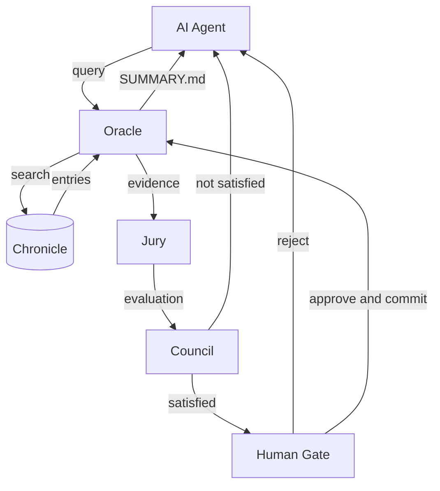
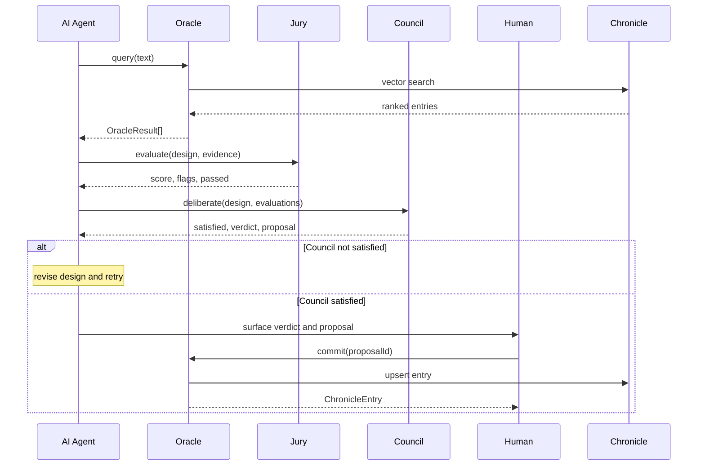

# Quorum

Quorum is a portable reasoning layer for agentic codebases.

Drop the `quorum/` folder into any Node.js project, tell your AI to follow `quorum/SETUP.md`, and it wires itself in — installing dependencies, merging instruction files, and initialising a persistent knowledge store called Chronicle.

From that point, every AI agent working in the codebase queries Chronicle before proposing solutions, and every significant decision gets written back to it (with human approval). Over time it becomes the institutional memory of the project: what was tried, what worked, what failed, and why.

---

## What's inside

Three portable TypeScript modules:

| Module | What it does |
|---|---|
| **Oracle** | Query and write interface to Chronicle. No LLM required. |
| **Jury** | Evaluates a proposed design against Oracle evidence. Returns a confidence score. |
| **Council** | Adversarial validation via a parallel panel of advisors and reviewers. Returns a verdict. |

```
oracle.query()  →  jury.evaluate()  →  council.deliberate()  →  human gate  →  Executor
```

---

## How it works

**Flow — system components and connections:**



**Sequence — one full decision cycle:**



---

## How to use it

1. Copy the `quorum/` folder into your project root
2. Tell your AI: *"follow quorum/SETUP.md"*
3. That's it — the AI handles the rest

See [quorum/SETUP.md](quorum/SETUP.md) for the full bootstrap sequence.

---

## Chronicle

Chronicle lives at `.chronicle/` and is the persistent knowledge store that underpins everything. Every Oracle entry goes through a human-gated write path — `oracle.propose()` stages it, a human calls `oracle.commit()` to index it. There are no auto-commits.

```
.chronicle/
  entries/        ← LanceDB vector store (indexed, not committed to git)
  proposals/      ← pending human-approval writes (JSON, committed to git)
  query-log.jsonl ← append-only audit log of every Oracle query
```

---

## Dependencies

| Package | Purpose |
|---|---|
| `zod` | Structured LLM output validation |
| `vectordb` | LanceDB embedded vector store (swappable) |
| `@xenova/transformers` | Local ONNX embedder — all-MiniLM-L6-v2 (swappable) |

The LLM provider is injectable — Quorum defines a simple function interface and never hardcodes a provider. Wire OpenAI, Anthropic, or anything else at the application level.

---

## Designed to be dropped in — not installed

Quorum is intentionally a folder, not an npm package. The source lives in your repo, the modules are readable by any AI agent working in the codebase, and the instruction files (`AGENTS.md`, `CLAUDE.md`) travel with the code. Nothing is hidden inside `node_modules`.

---

## Module docs

- [quorum/modules/README.md](quorum/modules/README.md) — full API reference and quick-start
- [quorum/modules/AGENTS.md](quorum/modules/AGENTS.md) — file ownership and invariants
- [quorum/modules/CLAUDE.md](quorum/modules/CLAUDE.md) — design decisions and what not to change
- [quorum/SETUP.md](quorum/SETUP.md) — bootstrap sequence for new projects
