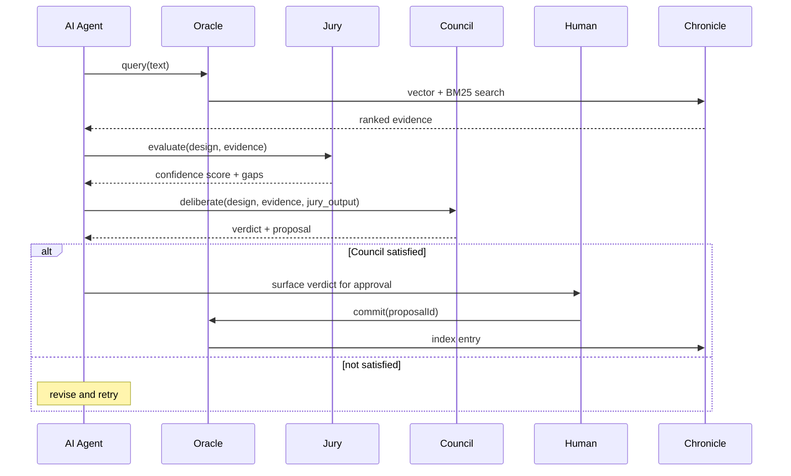

# Quorum

**Quorum gives AI agents memory and judgment.**

Drop it into any Node.js project, wire up your LLM, and your agents can query what's been tried before, validate decisions against prior evidence, and write new knowledge back — with a human approving every write.

```bash
npx @balpal4495/quorum@latest init
```

That's it. Quorum copies itself into your project, merges instruction files for your AI, and creates the knowledge store directory. Run `npm install` and you're ready.

---

## Why this exists

When AI agents work in a codebase over weeks or months, they lose context between sessions. They retry approaches that already failed. They contradict previous decisions. They have no memory of what the team has already learned.

Quorum solves this with four modules:

| Module | What it does |
|---|---|
| **Oracle** | Stores and retrieves project knowledge — decisions, investigations, outcomes |
| **Jury** | Scores a proposed design against that knowledge — gives you confidence before acting |
| **Council** | A panel of advisors challenges the design and a Chairman gives a final verdict |
| **Sentinel** | Shows you which parts of the codebase the AI knows nothing about — and flags stale knowledge |

---

## How it works

Every significant decision goes through a pipeline before execution:

```
oracle.query()  →  jury.evaluate()  →  council.deliberate()  →  human gate  →  Executor
```

1. **Query** — retrieve everything Chronicle knows about the problem
2. **Evaluate** — Jury scores the proposed design against that evidence (0–1 confidence)
3. **Deliberate** — Council advisors challenge it independently, reviewers anonymously critique, Chairman gives a verdict
4. **Human gate** — if satisfied, a human approves the Chronicle entry; nothing is written automatically
5. **Execute** — agent proceeds with a validated, documented decision



---

## Real examples

### Example 1 — An agent remembers a past failure

Your agent is about to propose JWT with symmetric signing. Oracle returns an entry:

```
[abc-123] Tried symmetric JWT (HS256) in March. Rejected — no way to rotate keys
          without invalidating all active sessions. Use RS256 with short-lived tokens.
          confidence: 0.91 · status: committed
```

Jury flags this as a conflict. The agent revises to RS256 before Council even sees it.

---

### Example 2 — Validating a database migration plan

An agent proposes adding a `NOT NULL` column to a 50M-row table.

```typescript
const evidence = await oracle.query("schema migrations large tables")

const jury = await evaluate({
  outcome: "Add NOT NULL column users.verified",
  design:  "ALTER TABLE, backfill with default false, then add constraint",
  evidence,
})
// jury.confidence: 0.41 — gaps: ["no lock strategy", "no rollback plan"]

const verdict = await deliberate({
  outcome: "Add NOT NULL column users.verified",
  design:  "ALTER TABLE, backfill with default false, then add constraint",
  evidence,
  jury_output: jury,
})
// verdict.satisfied: false
// verdict.verdict: "No lock strategy specified. On a table this size, a naive ALTER TABLE
//                   will take an exclusive lock for minutes. Use a shadow column pattern
//                   or pg_repack."
```

The agent revises the plan. Chronicle records the reasoning once approved.

---

### Example 3 — Onboarding a new AI to an established project

On day one, a fresh AI session queries Chronicle before touching anything:

```typescript
const evidence = await oracle.query("authentication, session handling, token strategy")
// Returns 6 entries covering prior decisions, a failed experiment with Redis sessions,
// the current RS256 approach, and a note about the upcoming OAuth migration.
```

The AI works with full context from the first message — no archaeology through git history.

---

## Quick start

```typescript
import { setup } from "./quorum/modules/setup"

const { oracle, evaluate, deliberate } = await setup({
  llm: myLLMProvider,  // any function that calls your LLM — see wiring below
})

// Query what Chronicle knows
const evidence = await oracle.query("authentication patterns in this codebase")

// Evaluate a proposed design
const jury = await evaluate({
  outcome: "Add OAuth2 login via GitHub",
  design:  "Use passport-github2, store sessions in Redis, 1-hour TTL",
  evidence,
})

// Get a Council verdict
const verdict = await deliberate({
  outcome: "Add OAuth2 login via GitHub",
  design:  "Use passport-github2, store sessions in Redis, 1-hour TTL",
  evidence,
  jury_output: jury,
})

if (verdict.satisfied) {
  // → surface verdict.proposal to a human for approval
  // → human calls oracle.commit(proposalId) to index it
  // → Executor proceeds
} else {
  // verdict.verdict contains the specific objection
  // verdict.recommendation is "redesign" or "investigate-more"
}
```

---

## Wiring your LLM

Quorum accepts any function with this signature — you're never locked in:

```typescript
import type { LLMProvider } from "./quorum/modules/shared/types"
```

```typescript
// Anthropic
const llm: LLMProvider = async (messages, model = "claude-3-5-sonnet-20241022") => {
  const system = messages.find(m => m.role === "system")?.content ?? ""
  const user   = messages.filter(m => m.role !== "system")
  const res = await anthropic.messages.create({ model, system, messages: user, max_tokens: 2048 })
  return res.content[0].type === "text" ? res.content[0].text : ""
}

// OpenAI
const llm: LLMProvider = async (messages, model = "gpt-4o") => {
  const res = await openai.chat.completions.create({ model, messages })
  return res.choices[0].message.content ?? ""
}

// Per-step model overrides (optional)
const { oracle, evaluate, deliberate } = await setup({
  llm,
  models: {
    jury: "gpt-4o-mini",
    council: {
      frame:    "gpt-4o-mini",
      advisors: "gpt-4o-mini",
      reviewers: "gpt-4o",
      chairman: "gpt-4o",
    },
  },
})
```

Oracle requires no LLM — only Jury, Council, and Sentinel drift checks need one.

---

## Chronicle — the knowledge store

Chronicle lives at `.chronicle/` in your project root. It persists across sessions, machines, and contributors.

```
.chronicle/
  committed/    ← approved entries as JSON (commit these to git)
  proposals/    ← staged entries awaiting approval (commit these too — they're human-readable)
  SUMMARY.md    ← auto-generated weekly context, rebuilt on every commit
```

**The write path is always human-gated:**

```
oracle.propose()   ← AI stages a candidate entry (no indexing yet)
oracle.commit()    ← human approves — entry is indexed and searchable
```

`deliberate()` automatically calls `oracle.propose()` at the end of every Council run. You only need to call `oracle.commit(proposalId)` when you're ready to approve it.

There are no auto-commits. Ever.

---

## Sentinel — codebase coverage and drift

Sentinel answers three questions Chronicle can't answer about itself.

### Which files does the AI know nothing about?

```typescript
import { coverage } from "./quorum/modules/sentinel"

const report = await coverage(".chronicle", "src")
// report.percentage       — 34%
// report.uncoveredFiles   — ["src/auth/session.ts", "src/payments/stripe.ts", ...]
```

### Is the AI's knowledge stale?

```typescript
import { detectDrift } from "./quorum/modules/sentinel"

const report = await detectDrift(".chronicle", "src", llm)
// report.flags — entries where the key_insight may no longer match the code
```

### Coverage as CI assertions

```typescript
import { describe } from "vitest"
import { sentinelAssertions } from "./quorum/modules/sentinel"

describe("sentinel", () => {
  sentinelAssertions({
    chronicleDir: ".chronicle",
    codebasePath: "src",
    llm: myLLMProvider,       // omit to skip drift tests
    minCoveragePercent: 50,   // 0 = advisory only (default — safe for new projects)
  }).forEach(a => a())
})
```

### PR coverage map

Add `.github/workflows/sentinel-pr.yml` (included in `quorum/`) to get a comment on every PR showing which modules are covered, which are blind spots, and which files the PR touches — as a table and a colour-coded Mermaid heatmap.

---

## Modules at a glance

| Module | Needs LLM | Entry point |
|---|---|---|
| Oracle | No | `oracle.query()` / `oracle.propose()` / `oracle.commit()` |
| Jury | Yes | `evaluate(input, deps)` |
| Council | Yes | `deliberate(input, deps)` |
| Sentinel | Optional | `coverage()` / `detectDrift()` / `sentinelAssertions()` |

Full API reference: [modules/README.md](modules/README.md)
Design decisions (what not to change): [modules/CLAUDE.md](modules/CLAUDE.md)

---

## Dependencies

| Package | Why |
|---|---|
| `zod` | Validates all structured LLM output — required |
| `vectordb` | LanceDB embedded vector store — default adapter, swappable |
| `@xenova/transformers` | Local ONNX embedder (all-MiniLM-L6-v2) — default adapter, swappable |

`vectordb` and `@xenova/transformers` are optional if you bring your own vector store and embedder. Implement the `VectorStore` interface in `oracle/types.ts` and pass your own `embedder` function to `setup()`.

---

## Releases

Quorum is published to npm as `@balpal4495/quorum`. New versions are released by pushing a semver tag:

```bash
git tag v0.2.0 && git push origin v0.2.0
```

GitHub Actions publishes to npm automatically via OIDC Trusted Publishing — no stored tokens.

---

## Docs

- [modules/README.md](modules/README.md) — full API reference
- [modules/AGENTS.md](modules/AGENTS.md) — file ownership and what each file owns
- [modules/CLAUDE.md](modules/CLAUDE.md) — design decisions and invariants
- [SETUP.md](SETUP.md) — manual bootstrap sequence (for AI-assisted setup)
