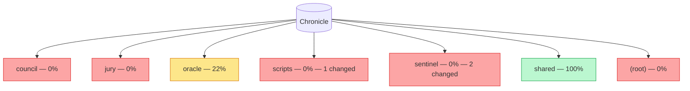

## Sentinel — Chronicle Coverage Map — 2026-W20

| Module | Coverage | Entries | Files | PR Changes | Risk |
|--------|----------|---------|-------|------------|------|
| council/ | 0% | 0 | 8 | — | high |
| jury/ | 0% | 0 | 4 | — | high |
| oracle/ | 22% | 4 | 9 | — | medium |
| **scripts/** | 0% | 0 | 1 | **1 files** | high |
| **sentinel/** | 0% | 0 | 5 | **2 files** | high |
| shared/ | 100% | 2 | 1 | — | low |
| (root)/ | 0% | 0 | 1 | — | high |

---
*Risk: high = 0% coverage, medium = 1-49%, low = 50%+*